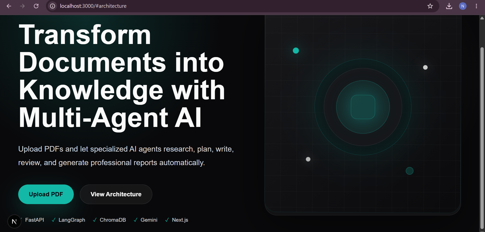
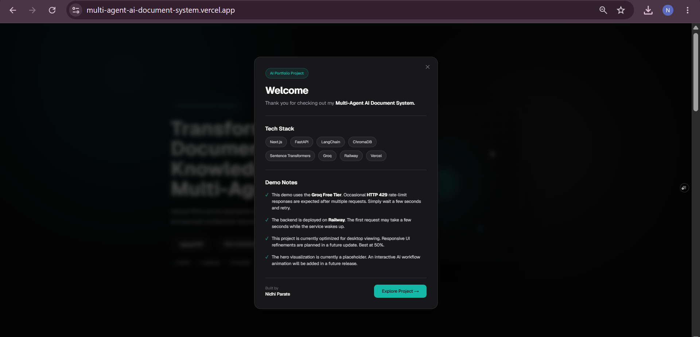
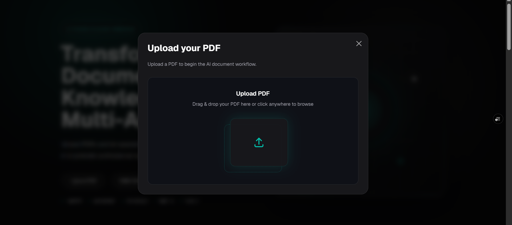
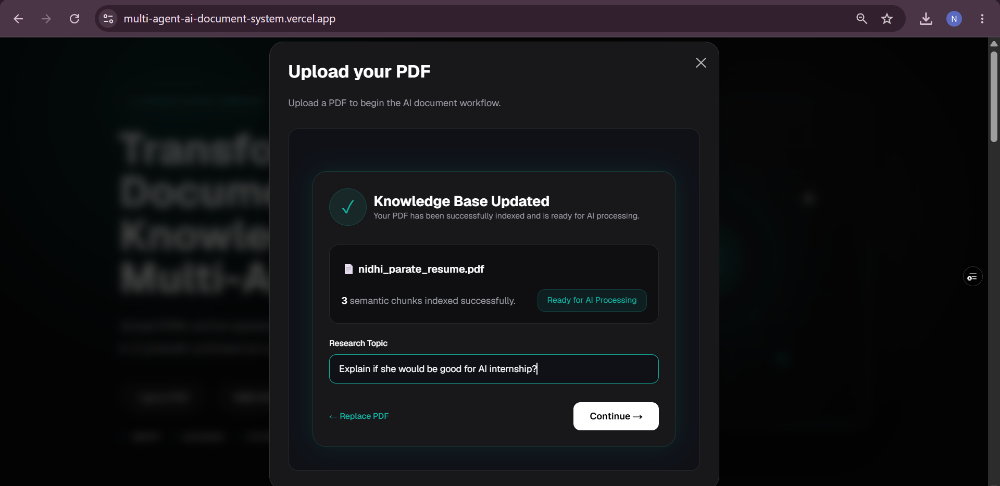
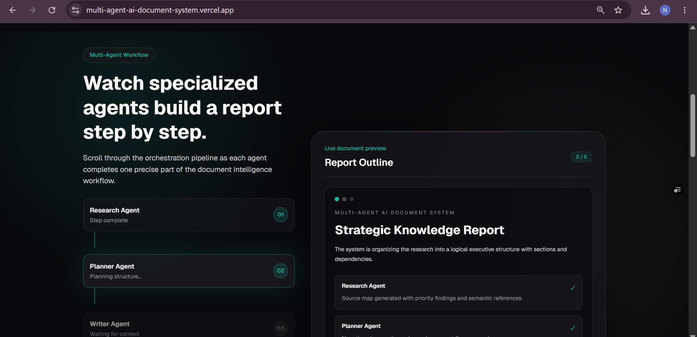
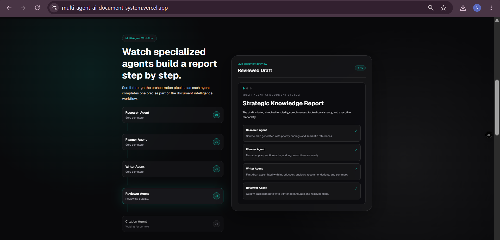
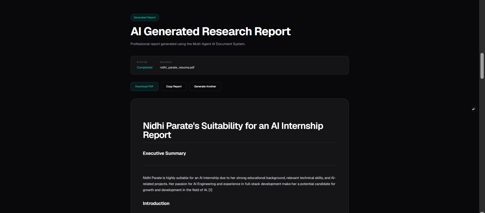
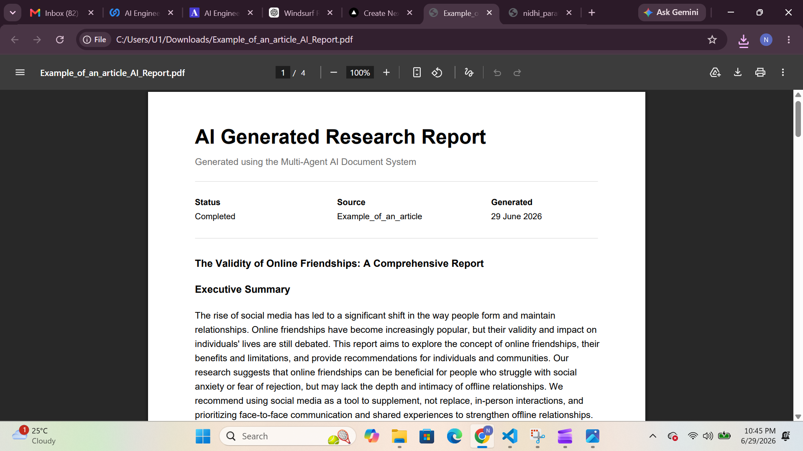
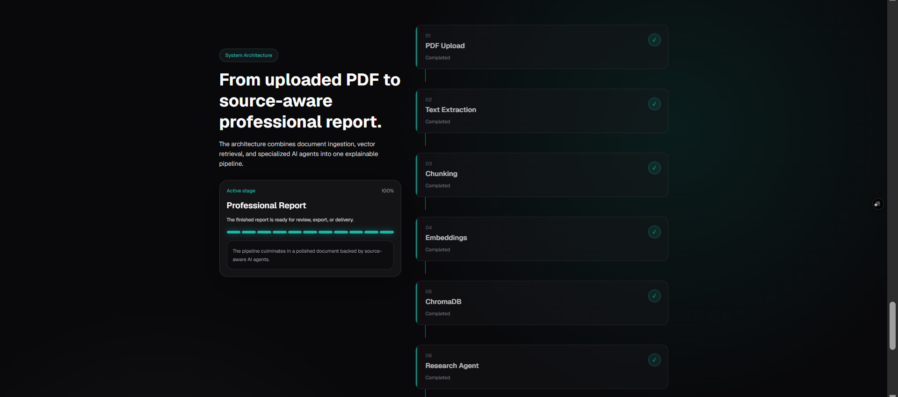

<div align="center">

# 🤖 Multi-Agent AI Document System

### An AI-powered document intelligence platform that transforms PDF documents into structured, citation-aware research reports using a Multi-Agent Retrieval-Augmented Generation (RAG) pipeline.

<p align="center">


</p>

*A modern full-stack AI application that demonstrates how multiple specialized AI agents collaborate to retrieve knowledge, reason over documents, generate structured reports, review content, and automatically produce citation-backed outputs.*

</div>

---

# 🌐 Live Demo

| Service | Link |
|----------|------|
| **🎨 Frontend (Portfolio)** | https://nidhi-parate-portfolio.vercel.app/ |
| **⚙️ Backend API** | https://multi-agent-ai-document-system-production.up.railway.app/ |

> **Note:** The backend is deployed on Railway's free tier and uses the free Groq API. During peak usage, report generation may occasionally be delayed or temporarily rate-limited.

---

# 🎥 Demo

The complete project walkthrough is included in this repository.

📥 **Download the demo video**

[`docs/demo/multi-agent-ai-document-system-demo.mp4`](docs/demo/multi-agent-ai-document-system-demo.mp4)

---

# 📸 Project Preview

## Landing Page



---

## Welcome Modal



---

## Upload PDF



---

## Knowledge Base Updated



---

## Multi-Agent Workflow





---

## Generated Research Report



---

## Downloadable PDF Report



---

## System Architecture



---

# 📖 Overview

Traditional Large Language Model (LLM) applications often rely on a single prompt to analyze entire documents. While this works for simple tasks, it becomes increasingly unreliable as documents grow larger, making it difficult to maintain context, produce consistent structure, and explain the reasoning process.

This project explores a **Multi-Agent Retrieval-Augmented Generation (RAG)** architecture that decomposes document understanding into specialized AI agents. Rather than assigning every responsibility to a single model, each agent focuses on one stage of the workflow—research, planning, writing, reviewing, or citation generation—while sharing contextual information retrieved from a semantic knowledge base.

When a PDF is uploaded, the application:

- extracts its text,
- generates semantic embeddings using Sentence Transformers,
- stores those embeddings in ChromaDB,
- retrieves the most relevant document chunks through semantic search,
- orchestrates multiple AI agents using LangGraph,
- and produces a structured, citation-aware research report grounded in the uploaded document.

Beyond document summarization, the project demonstrates several modern AI engineering concepts, including:

- 🤖 Multi-Agent AI Systems
- 📚 Retrieval-Augmented Generation (RAG)
- 🔎 Semantic Search
- 🧠 Vector Databases
- 🔗 AI Workflow Orchestration
- ⚡ Full-Stack AI Application Development
- 🎨 Interactive Workflow Visualization

---

# 🎯 Potential Use Cases

- 📄 Research paper analysis
- 📚 Study guide generation
- 🏢 Enterprise knowledge assistants
- 📑 Technical documentation
- ⚖️ Legal document summarization
- 📊 Business intelligence reports
- 📖 Policy & compliance review
- 🎓 Educational content generation

---

# ✨ Features

## Core Functionality

- 📄 Upload and process PDF documents
- 🧩 Automatic text extraction
- ✂️ Intelligent semantic chunking
- 🧠 Embedding generation using Sentence Transformers
- 🗄️ Persistent vector storage with ChromaDB
- 🔍 Semantic document retrieval
- 🤖 Multi-Agent report generation
- 📝 Citation-aware research reports
- 📑 Professional PDF export
- 📋 One-click report copying

---

## Interactive Experience

- ⚡ Live workflow progress visualization
- 🎯 Dedicated AI agent pipeline
- 🎨 Modern responsive interface
- ✨ Smooth GSAP-powered animations
- 📊 Interactive system architecture diagram
- 🔄 Generate multiple reports from the same knowledge base
- 🎉 Welcome modal for first-time visitors

---

# 🏗️ System Architecture

The application follows a modular architecture where a Next.js frontend communicates with a FastAPI backend responsible for orchestrating the Retrieval-Augmented Generation (RAG) workflow. Instead of relying on a single LLM call, the system delegates responsibilities to multiple specialized AI agents using LangGraph.

```mermaid
flowchart LR

A[Next.js Frontend]

B[FastAPI Backend]

C[PDF Upload]

D[Text Extraction]

E[Semantic Chunking]

F[SentenceTransformer Embeddings]

G[(ChromaDB)]

H[Retriever]

I[LangGraph Workflow]

J[Research Agent]

K[Planner Agent]

L[Writer Agent]

M[Reviewer Agent]

N[Citation Agent]

O[Generated Report]

A --> B
B --> C
C --> D
D --> E
E --> F
F --> G
G --> H
H --> I
I --> J
J --> K
K --> L
L --> M
M --> N
N --> O

---

# 🔄 End-to-End Workflow

From the moment a document is uploaded, the application follows a structured processing pipeline.


📄 Upload PDF
        │
        ▼
Extract Text
        │
        ▼
Split into Semantic Chunks
        │
        ▼
Generate Embeddings
        │
        ▼
Store in ChromaDB
        │
        ▼
Retrieve Relevant Context
        │
        ▼
Research Agent
        │
        ▼
Planner Agent
        │
        ▼
Writer Agent
        │
        ▼
Reviewer Agent
        │
        ▼
Citation Agent
        │
        ▼
📑 Final Research Report

---

# 🤖 Why a Multi-Agent Workflow?

Most AI document assistants rely on a single prompt to retrieve information and generate a response. While simple, this approach makes it difficult to maintain structure, verify outputs, or extend the system with additional capabilities.

This project adopts a **specialized multi-agent architecture**, where each agent is responsible for one clearly defined task. The output of one agent becomes the input for the next, creating a modular pipeline that is easier to understand, debug, and improve.

| Agent | Responsibility |
|--------|----------------|
| 🔍 Research Agent | Retrieves and summarizes relevant document context |
| 📝 Planner Agent | Creates a structured outline for the report |
| ✍️ Writer Agent | Generates the first draft |
| 🧐 Reviewer Agent | Improves clarity, consistency, and readability |
| 📚 Citation Agent | Inserts citation markers and builds the references section |

This separation of concerns mirrors collaborative engineering workflows and makes the system significantly more maintainable than a single-prompt solution.

---


# 🧠 Retrieval-Augmented Generation (RAG)

At the core of this project is a **Retrieval-Augmented Generation (RAG)** pipeline.

Rather than sending the entire PDF directly to a Large Language Model, the system first converts the document into a searchable semantic knowledge base. When the user requests a report, only the most relevant document chunks are retrieved and provided as context to the AI agents.

This approach significantly improves factual accuracy, reduces hallucinations, and allows the application to scale to larger documents while keeping prompts concise.

```text
                PDF Document
                     │
                     ▼
            Text Extraction (PyPDF)
                     │
                     ▼
           Semantic Text Chunking
                     │
                     ▼
      SentenceTransformer Embeddings
                     │
                     ▼
              ChromaDB Vector Store
                     │
                     ▼
            Semantic Similarity Search
                     │
                     ▼
            Relevant Context Retrieval
                     │
                     ▼
          LangGraph Multi-Agent Pipeline
                     │
                     ▼
      Citation-Aware Research Report


---

# 💻 Technology Stack

| Category | Technologies |
|-----------|--------------|
| **Frontend** | Next.js 16, React 19, TypeScript, Tailwind CSS |
| **Animations** | GSAP, Framer Motion |
| **Backend** | FastAPI, Python |
| **AI Frameworks** | LangChain, LangGraph |
| **LLM Provider** | Groq (Llama 3.1) |
| **Embeddings** | Sentence Transformers (`all-MiniLM-L6-v2`) |
| **Vector Database** | ChromaDB |
| **Document Processing** | PyPDF |
| **PDF Generation** | jsPDF |
| **Deployment** | Vercel (Frontend), Railway (Backend) |
| **Version Control** | Git & GitHub |

---

# 🏛️ Engineering Decisions

Every major technology used in this project was selected to solve a specific architectural problem rather than simply following popular trends.

---

## FastAPI

FastAPI provides lightweight asynchronous APIs with automatic validation, excellent developer experience, and built-in OpenAPI documentation. It integrates naturally with AI workflows and offers high performance for backend services.

---

## Next.js

Next.js was chosen to build a responsive frontend capable of presenting complex AI workflows through an interactive user interface while remaining easy to deploy on Vercel.

---

## LangGraph

Instead of chaining prompts together manually, LangGraph provides explicit workflow orchestration.

Each AI agent performs one clearly defined responsibility, making the system easier to understand, debug, and extend.

---

## LangChain

LangChain simplifies interactions with language models and provides abstractions for prompts, document retrieval, and model providers while remaining flexible enough to swap providers with minimal changes.

---

## ChromaDB

ChromaDB acts as the semantic memory of the application.

Rather than repeatedly processing uploaded PDFs, embeddings are stored locally and retrieved through vector similarity search, enabling fast and context-aware responses.

---

## Sentence Transformers

The `all-MiniLM-L6-v2` embedding model was selected because it provides a strong balance between retrieval quality, inference speed, and memory efficiency, making it well suited for semantic document search.

---

## Groq

Groq offers extremely fast inference for open-weight language models, making it ideal for an interactive application where users expect quick report generation.

The application also abstracts model creation through an LLM Factory, allowing providers such as Gemini or OpenAI to be integrated with minimal code changes.

---

## Modular Multi-Agent Architecture

Instead of building a single, large report-generation function, the system separates responsibilities into independent AI agents.

This design improves:

- Maintainability
- Readability
- Debugging
- Extensibility
- Reusability

Adding new capabilities—such as fact-checking, summarization, translation, or evaluation agents—can be achieved without redesigning the existing workflow.

---

# 📂 Project Structure

```text
multi-agent-ai-document-system
│
├── backend
│   ├── app
│   │   ├── agents
│   │   ├── api
│   │   ├── core
│   │   ├── graph
│   │   ├── rag
│   │   ├── services
│   │   └── main.py
│   │
│   ├── requirements.txt
│   └── .env.example
│
├── frontend
│   ├── app
│   ├── components
│   ├── lib
│   ├── public
│   ├── utils
│   └── package.json
│
├── docs
│   ├── demo
│   └── images
│
├── LICENSE
└── README.md


---

````md
# 🚀 Getting Started

## Prerequisites

Before running the project, ensure you have the following installed:

- Python 3.11+
- Node.js 20+
- npm
- Git

You'll also need a Groq API key (or another supported LLM provider).

---

## Clone the Repository

```bash
git clone https://github.com/n1dhiparate/multi-agent-ai-document-system.git

cd multi-agent-ai-document-system
```


## Backend Setup

Navigate to the backend directory.

```bash
cd backend
```

Create a virtual environment.

```bash
python -m venv venv
```

Activate it.

### Windows

```bash
venv\Scripts\activate
```

### macOS/Linux

```bash
source venv/bin/activate
```

Install dependencies.

```bash
pip install -r requirements.txt
```

---

## Frontend Setup

Open a new terminal.

```bash
cd frontend

npm install
```

---

# 🔑 Environment Variables

## Backend (`backend/.env`)

```env
MODEL_PROVIDER=groq

MODEL_NAME=llama-3.1-8b-instant

GROQ_API_KEY=your_api_key
```

---

## Frontend (`frontend/.env.local`)

```env
NEXT_PUBLIC_API_URL=http://localhost:8000
```

---

# ▶️ Running the Application

Start the backend.

```bash
uvicorn app.main:app --reload
```

Start the frontend.

```bash
npm run dev
```

Open your browser:

```
http://localhost:3000
```

---

# 🌐 Deployment

| Component | Platform |
|-----------|----------|
| Frontend | Vercel |
| Backend | Railway |

---

# 📡 API Endpoints

| Method | Endpoint | Description |
|---------|----------|-------------|
| POST | `/upload-pdf` | Upload and process PDF documents |
| GET | `/generate` | Start report generation |
| GET | `/progress` | Retrieve live workflow progress |
| GET | `/search` | Perform semantic search |
| GET | `/ask` | Ask questions about uploaded documents |
| GET | `/vector-count` | Number of stored document chunks |

---

# ⚡ Challenges & Solutions

Building a multi-agent AI application introduced several engineering challenges that required architectural rather than purely implementation-focused solutions.

| Challenge | Solution |
|------------|----------|
| Processing long PDF documents efficiently | Split documents into semantic chunks before embedding. |
| Preventing LLM hallucinations | Implemented Retrieval-Augmented Generation (RAG) using ChromaDB. |
| Managing multiple AI agents | Used LangGraph to orchestrate a modular workflow instead of a single prompt. |
| Keeping the interface responsive | Report generation runs asynchronously while the frontend polls workflow progress. |
| Supporting different LLM providers | Centralized model creation using an LLM Factory to simplify provider switching. |
| Deployment across multiple services | Configured independent deployments on Railway (backend) and Vercel (frontend) using environment variables. |

---

# 📈 Performance Notes

The application is designed to minimize unnecessary computation.

- Embeddings are generated only during document ingestion.
- ChromaDB persists vector embeddings for future queries.
- Semantic retrieval limits prompt size by selecting only the most relevant chunks.
- Workflow progress is exposed through a dedicated endpoint, allowing the frontend to visualize each AI agent in real time.
- LLM providers are abstracted through a factory pattern, making future integrations straightforward.

> **Note:** The deployed application uses the **free Groq API tier**. During periods of high demand, requests may occasionally be delayed or temporarily rate-limited (`HTTP 429`). This is expected behavior and does not affect the application architecture.

---

# 🛣️ Future Improvements

- [ ] Streaming AI responses
- [ ] Authentication & user accounts
- [ ] Multi-document workspaces
- [ ] Conversational document chat
- [ ] DOCX export
- [ ] Report history
- [ ] Interactive citation links
- [ ] Docker containerization
- [ ] CI/CD pipeline
- [ ] Automated unit and integration tests
- [ ] Mobile UI optimization
- [ ] Cloud storage for uploaded documents

---

# 🤝 Contributing

Contributions, feature suggestions, and bug reports are always welcome.

If you'd like to contribute:

1. Fork the repository.
2. Create a feature branch.
3. Commit your changes.
4. Open a Pull Request.

---

# 📄 License

This project is licensed under the **MIT License**.

---

# 🙏 Acknowledgements

This project would not have been possible without the excellent open-source ecosystem.

Special thanks to:

- FastAPI
- Next.js
- LangChain
- LangGraph
- ChromaDB
- Sentence Transformers
- Groq
- React
- Tailwind CSS
- GSAP
- jsPDF

---

# 👩‍💻 Author

## Nidhi Parate

B.Tech Information Technology Student

Passionate about building AI-powered applications, intelligent developer tools, and modern full-stack systems.

### Connect with Me

- **GitHub**  
  https://github.com/n1dhiparate

- **LinkedIn**  
  https://www.linkedin.com/in/nidhi-parate/

- **Portfolio**  
  https://nidhi-parate-portfolio.vercel.app/

---

<div align="center">

### ⭐ If you found this project interesting, consider giving it a star!

Thank you for taking the time to explore the project.

</div>


