<div align="center">

# 🤖 Multi-Agent AI Research Assistant

### A full-stack Retrieval-Augmented Generation (RAG) application that transforms PDF documents into structured, citation-aware research reports through a collaborative multi-agent AI workflow.

<p align="center">


</p>

*A modern AI system that indexes PDF documents into a semantic knowledge base and orchestrates multiple specialized AI agents to research, plan, write, review, and cite comprehensive reports.*

</div>

---

# 🚀 Live Application

| Service                 | URL                                                               |
| ----------------------- | ----------------------------------------------------------------- |
| 🌐 **Live Application** | https://multi-agent-ai-document-system.vercel.app/                |
| ⚙️ **Backend API**      | https://multi-agent-ai-document-system-production.up.railway.app/ |

> **Note**
>
> This project is deployed using the free tiers of Railway and Groq. During periods of high demand, report generation may occasionally be delayed or temporarily rate-limited (`HTTP 429`).

---

# 🎥 Demo

A complete walkthrough of the application is included in the repository.

📥 **Demo Video**

`docs/demo/multi-agent-ai-document-system-demo.mp4`

---

# 📸 Project Preview

### Landing Page


---

### Upload & Knowledge Base Creation

| Upload PDF                      | Indexed Successfully                        |
| ------------------------------- | ------------------------------------------- |
|  |  |

---

### Multi-Agent Workflow

| Agent Progress                       | Report Generation                    |
| ------------------------------------ | ------------------------------------ |
|  |  |

---

### Generated Research Report


---

### Exported PDF


---

### System Architecture


---

# 📖 Why This Project?

Most document AI applications rely on a **single prompt** to summarize an uploaded file. While simple to implement, that approach often struggles with long documents, lacks transparency, and becomes increasingly difficult to extend as new capabilities are added.

This project explores a different architecture.

Instead of relying on a single LLM call, it combines **Retrieval-Augmented Generation (RAG)** with a **LangGraph-orchestrated multi-agent workflow**. Uploaded PDFs are transformed into a semantic knowledge base using embeddings and ChromaDB. Specialized AI agents then collaborate to retrieve relevant context, organize information, generate structured reports, review content, and produce citation-aware outputs.

The result is a modular system that is easier to understand, maintain, and extend than a traditional single-prompt implementation.

---

# ⭐ Repository Highlights

* 🤖 Multi-Agent workflow orchestrated with **LangGraph**
* 📚 Retrieval-Augmented Generation (RAG) using **ChromaDB**
* 🧠 Semantic retrieval powered by **Sentence Transformers**
* 📄 Professional research report generation with citations
* ⚡ Live workflow visualization during AI execution
* 📑 Export reports as professionally formatted PDFs
* 🌐 Fully deployed using **Vercel** and **Railway**

---

# ✨ Features

### 📄 Document Processing

- Upload PDF documents through a modern drag-and-drop interface
- Automatically extract text from uploaded PDFs
- Split documents into semantically meaningful chunks
- Generate dense vector embeddings using Sentence Transformers
- Persist embeddings in ChromaDB for efficient retrieval

---

### 🧠 Retrieval-Augmented Generation (RAG)

- Semantic similarity search over indexed documents
- Context-aware retrieval for every AI agent
- Ground responses using retrieved document chunks
- Reduce hallucinations by avoiding knowledge outside the uploaded PDF

---

### 🤖 Multi-Agent AI Workflow

- Dedicated **Research Agent** for contextual analysis
- **Planner Agent** to organize report structure
- **Writer Agent** for report generation
- **Reviewer Agent** for quality improvement
- **Citation Agent** for reference generation

---

### 🎨 User Experience

- Live workflow visualization
- Real-time agent progress tracking
- Professional report viewer
- One-click PDF export
- Copy generated reports instantly
- Responsive modern interface
- Smooth GSAP-powered animations

---

# 🏗️ System Architecture

The application follows a modular full-stack architecture. The frontend is responsible for user interaction and workflow visualization, while the backend manages document ingestion, semantic retrieval, AI orchestration, and report generation.

```mermaid
flowchart LR

A[Next.js Frontend]
B[FastAPI Backend]

C[PDF Upload]

D[Text Extraction]

E[Chunking]

F[SentenceTransformer Embeddings]

G[(ChromaDB)]

H[Semantic Retriever]

I[LangGraph]

J[Research Agent]

K[Planner Agent]

L[Writer Agent]

M[Reviewer Agent]

N[Citation Agent]

O[Generated Report]

A --> B
B --> C
C --> D
D --> E
E --> F
F --> G
G --> H
H --> I
I --> J
J --> K
K --> L
L --> M
M --> N
N --> O
```



---

# 🔄 End-to-End Workflow

Every uploaded document passes through a structured pipeline before a report is generated.

```text
📄 Upload PDF
      │
      ▼
Extract Text
      │
      ▼
Semantic Chunking
      │
      ▼
Generate Embeddings
      │
      ▼
Store in ChromaDB
      │
      ▼
Semantic Retrieval
      │
      ▼
Research Agent
      │
      ▼
Planner Agent
      │
      ▼
Writer Agent
      │
      ▼
Reviewer Agent
      │
      ▼
Citation Agent
      │
      ▼
📑 Final Research Report
```

---

# 🤖 Multi-Agent Workflow

Rather than relying on a single LLM prompt to perform every task, this project distributes responsibilities across multiple specialized AI agents.

Each agent performs one well-defined task and passes its output to the next stage, creating a modular workflow that is easier to debug, extend, and maintain.

| Agent | Responsibility |
|--------|----------------|
| 🔍 **Research Agent** | Retrieves relevant context and generates research notes |
| 📝 **Planner Agent** | Creates a structured outline for the report |
| ✍️ **Writer Agent** | Produces the initial report draft |
| 🧐 **Reviewer Agent** | Refines readability, clarity, and consistency |
| 📚 **Citation Agent** | Inserts citations and generates the references section |

This design follows the **single responsibility principle**—each agent focuses on one task, making the system easier to scale and evolve over time.

---

# ⚙️ Why LangGraph?

Traditional AI applications often chain prompts together manually, making workflows difficult to extend and debug.

LangGraph provides explicit orchestration of agent interactions, allowing the workflow to be represented as a graph instead of a collection of disconnected function calls.

For this project, LangGraph enables:

- Clear separation of responsibilities between agents
- Easier debugging of individual workflow stages
- Better maintainability as new agents are introduced
- A scalable architecture for future enhancements such as fact-checking, summarization, or translation agents

Instead of asking one model to do everything, the application treats report generation as a collaborative workflow where each agent contributes a specific piece of the final output.

---

# 🧠 Retrieval-Augmented Generation (RAG)

Large Language Models have a limited context window and can generate inaccurate or fabricated information when asked questions about documents they have never seen.

To address this, the application implements a **Retrieval-Augmented Generation (RAG)** pipeline.

Instead of sending an entire PDF directly to the language model, the document is transformed into a searchable semantic knowledge base. When a report is requested, only the most relevant document chunks are retrieved and supplied to the AI agents as context.

This approach improves factual grounding, reduces hallucinations, minimizes prompt size, and scales more effectively to larger documents.

```text
                PDF Document
                     │
                     ▼
             Text Extraction
                     │
                     ▼
          Semantic Text Chunking
                     │
                     ▼
     SentenceTransformer Embeddings
                     │
                     ▼
           ChromaDB Vector Store
                     │
                     ▼
        Semantic Similarity Search
                     │
                     ▼
          Context Retrieval (Top-K)
                     │
                     ▼
      LangGraph Multi-Agent Workflow
                     │
                     ▼
      Citation-Aware Research Report
```

---

# 💻 Technology Stack

| Layer | Technologies |
|--------|--------------|
| **Frontend** | Next.js 16, React 19, TypeScript, Tailwind CSS |
| **Animation** | GSAP, Framer Motion |
| **Backend** | FastAPI, Python |
| **AI Frameworks** | LangChain, LangGraph |
| **LLM Provider** | Groq (Llama 3.x) |
| **Embeddings** | SentenceTransformers (`all-MiniLM-L6-v2`) |
| **Vector Database** | ChromaDB |
| **Document Processing** | PyPDF |
| **PDF Generation** | jsPDF |
| **Deployment** | Vercel, Railway |
| **Version Control** | Git & GitHub |

---

# 🏛️ Engineering Decisions

Every major technology in this project was selected to solve a specific engineering problem.

| Decision | Why it was chosen |
|-----------|-------------------|
| **FastAPI** | Lightweight asynchronous backend with automatic API documentation and excellent performance for AI workloads. |
| **Next.js** | Modern React framework providing a responsive UI and seamless deployment on Vercel. |
| **LangGraph** | Enables explicit orchestration of specialized AI agents instead of relying on a single prompt. |
| **LangChain** | Simplifies LLM interactions, prompt management, and retrieval workflows while remaining provider-agnostic. |
| **ChromaDB** | Persistent vector database for semantic search without requiring external infrastructure. |
| **Sentence Transformers** | Generates compact, high-quality embeddings suitable for semantic retrieval. |
| **Groq** | Low-latency inference for interactive AI applications using open-weight Llama models. |

---

# 🗂️ Project Structure

```text
multi-agent-ai-document-system
│
├── backend/
│   ├── app/
│   │   ├── agents/
│   │   ├── api/
│   │   ├── core/
│   │   ├── graph/
│   │   ├── rag/
│   │   ├── services/
│   │   └── main.py
│   │
│   ├── requirements.txt
│   └── .env.example
│
├── frontend/
│   ├── app/
│   ├── components/
│   ├── lib/
│   ├── public/
│   ├── utils/
│   └── package.json
│
├── docs/
│   ├── demo/
│   └── images/
│
├── README.md
└── LICENSE
```

---

# ⚡ Performance Considerations

The system was designed to minimize unnecessary computation while keeping report generation responsive.

- Embeddings are generated only once during document ingestion.
- ChromaDB persists vectors for future retrieval instead of recomputing embeddings.
- Only the most relevant document chunks are sent to the LLM, reducing token usage.
- Workflow execution runs asynchronously while the frontend displays real-time progress.
- The LLM Factory abstracts provider selection, making it easy to switch between Groq, Gemini, or OpenAI with minimal code changes.

Although the current deployment targets portfolio-scale usage, the overall architecture can be extended to support larger document collections and additional AI agents with relatively small changes.

---

# 🚀 Getting Started

## Prerequisites

Before running the project locally, ensure the following are installed:

- Python 3.11+
- Node.js 20+
- npm
- Git
- A Groq API Key *(or another supported LLM provider)*

---

## Clone the Repository

```bash
git clone https://github.com/n1dhiparate/multi-agent-ai-document-system.git

cd multi-agent-ai-document-system
```

---

## Backend Setup

Navigate to the backend directory.

```bash
cd backend
```

Create and activate a virtual environment.

### Windows

```bash
python -m venv venv

venv\Scripts\activate
```

### macOS / Linux

```bash
python3 -m venv venv

source venv/bin/activate
```

Install dependencies.

```bash
pip install -r requirements.txt
```

---

## Frontend Setup

Open another terminal.

```bash
cd frontend

npm install
```

---

# 🔑 Environment Variables

Create a `.env` file inside the backend directory.

```env
MODEL_PROVIDER=groq

MODEL_NAME=llama-3.1-8b-instant

GROQ_API_KEY=your_groq_api_key
```

Create a `.env.local` file inside the frontend directory.

```env
NEXT_PUBLIC_API_URL=http://localhost:8000
```

---

# ▶️ Running the Application

Start the backend.

```bash
uvicorn app.main:app --reload
```

Start the frontend.

```bash
npm run dev
```

Visit

```
http://localhost:3000
```

---

# 📡 API Overview

| Method | Endpoint | Description |
|---------|----------|-------------|
| POST | `/upload-pdf` | Upload and index a PDF document |
| GET | `/generate` | Start the multi-agent report generation workflow |
| GET | `/progress` | Retrieve live workflow progress |
| GET | `/ask` | Ask questions about uploaded documents |
| GET | `/search` | Perform semantic document search |
| GET | `/vector-count` | Return the number of indexed document chunks |

---

# ⚙️ Challenges & Solutions

| Challenge | Solution |
|-----------|----------|
| Processing long PDF documents efficiently | Split documents into semantic chunks before embedding. |
| Reducing hallucinations | Implemented Retrieval-Augmented Generation (RAG) using ChromaDB. |
| Coordinating multiple AI agents | Used LangGraph to orchestrate the workflow instead of chaining prompts manually. |
| Maintaining UI responsiveness | Report generation runs asynchronously while the frontend polls workflow progress. |
| Supporting multiple LLM providers | Centralized model creation using an LLM Factory, allowing providers to be swapped with minimal changes. |
| Deployment across multiple services | Deployed the frontend on Vercel and the backend on Railway using environment-specific configuration. |

---

# 🛣️ Future Improvements

- [ ] Conversational document chat
- [ ] Streaming AI responses
- [ ] Multi-document workspaces
- [ ] Authentication & user accounts
- [ ] Report history
- [ ] DOCX export
- [ ] Interactive citation navigation
- [ ] Docker support
- [ ] CI/CD pipeline
- [ ] Automated testing
- [ ] Mobile-first interface improvements
- [ ] Cloud storage for uploaded documents

---

# 🤝 Contributing

Contributions, feature requests, and bug reports are always welcome.

If you'd like to contribute:

1. Fork the repository.
2. Create a feature branch.
3. Commit your changes.
4. Open a Pull Request.

---

# 📄 License

This project is licensed under the **MIT License**.

---

# 🙏 Acknowledgements

This project was built using the following open-source technologies:

- FastAPI
- Next.js
- React
- LangChain
- LangGraph
- ChromaDB
- Sentence Transformers
- Groq
- Tailwind CSS
- GSAP
- jsPDF

A big thank you to the open-source community for building and maintaining these tools.

---

# 👩‍💻 About the Author

## Nidhi Parate

**B.Tech Information Technology Student**

I'm passionate about building intelligent software systems that combine AI, modern web technologies, and thoughtful user experiences. My interests include Retrieval-Augmented Generation (RAG), AI Agents, Full-Stack Development, and Developer Tools.

### Connect with Me

- 🌐 **Portfolio**  
  https://nidhi-parate-portfolio.vercel.app/

- 💼 **LinkedIn**  
  https://www.linkedin.com/in/nidhi-parate/

- 💻 **GitHub**  
  https://github.com/n1dhiparate

---

<div align="center">

### ⭐ If you found this project interesting, please consider giving it a star!

Thank you for taking the time to explore the project.

</div>


