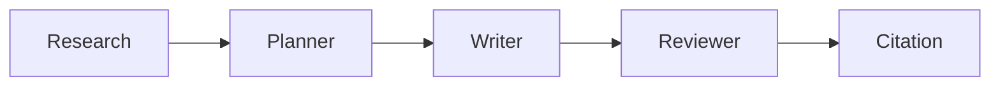

#  Multi-Agent AI Document System

> Transform PDFs into structured, citation-backed research reports using a Retrieval-Augmented Generation (RAG) pipeline orchestrated by specialized AI agents.

<div align="center">


</div>

<div align="center">

*A modern AI document intelligence platform that demonstrates how multiple specialized AI agents can collaborate to analyze, reason over, and generate professional reports from unstructured PDF documents.*

</div>

---

## 🎥 Demo

> **📹 Demo Video**

<TODO: Add Demo GIF>

or

[](<TODO: Demo Link>)

---

## 🖼️ Screenshots

### Landing Page


### Upload PDF


### Knowledge Base Updated


### Multi-Agent Workflow


### Generated Report


### Downloaded PDF


### System Architecture


---

# 📖 Overview

Large Language Models are excellent at generating text, but a single prompt often struggles with long documents, structured reasoning, and producing consistently organized outputs.

This project explores a **multi-agent approach** to document intelligence by combining **Retrieval-Augmented Generation (RAG)** with **specialized AI agents**, where each agent is responsible for a distinct stage of the report generation process.

Instead of relying on one monolithic LLM call, the system first builds a semantic knowledge base from an uploaded PDF using embeddings and a vector database. Relevant context is then retrieved and passed through a LangGraph-orchestrated workflow consisting of dedicated Research, Planner, Writer, Reviewer, and Citation agents.

The result is a transparent, modular pipeline that produces structured, citation-aware reports while making every stage of the reasoning process visible through an interactive web interface.

This project was built to demonstrate practical applications of:

- Multi-Agent AI Systems
- Retrieval-Augmented Generation (RAG)
- Semantic Search
- Vector Databases
- LLM Workflow Orchestration
- Modern Full-Stack AI Application Development

---

## 🎯 Real World Use Cases

- 📄 Research paper summarization
- 📚 Study guide generation
- 🏢 Internal company knowledge assistants
- ⚖️ Legal document analysis
- 📑 Technical documentation generation
- 📊 Business report creation
- 📖 Policy & compliance review
- 🎓 Educational content generation

---

# ✨ Features

## Core Functionality

- ✅ Upload and process PDF documents
- ✅ Automatic text extraction using PyPDF
- ✅ Intelligent document chunking for semantic retrieval
- ✅ Local embedding generation using Sentence Transformers
- ✅ Persistent vector storage with ChromaDB
- ✅ Retrieval-Augmented Generation (RAG)
- ✅ Multi-Agent orchestration using LangGraph
- ✅ Structured report generation
- ✅ Automatic citation generation
- ✅ Professional PDF export
- ✅ Copy report to clipboard
- ✅ Generate multiple reports from uploaded knowledge base

---

## User Experience

- ✅ Modern SaaS-inspired interface
- ✅ Interactive AI workflow visualization
- ✅ Live workflow progress tracking
- ✅ Beautiful markdown report rendering
- ✅ Responsive layout
- ✅ Smooth GSAP animations
- ✅ Welcome modal for first-time visitors
- ✅ Clean architecture visualization
- ✅ Download generated reports as PDF

---

## AI Capabilities

- 🧠 Semantic document search
- 📚 Context-aware report generation
- 🔍 Retrieval-based question answering
- 📝 AI-generated report outlining
- ✍️ Technical writing
- 🧐 AI-powered review and refinement
- 📖 Automatic citation insertion

---

# 🏗️ System Architecture

The application follows a modular full-stack architecture where the frontend communicates with a FastAPI backend that orchestrates a Retrieval-Augmented Generation (RAG) pipeline using LangGraph. Instead of a single AI model handling every task, specialized agents collaborate to generate higher-quality reports.


---

# 🔄 End-to-End Workflow

When a user uploads a PDF, the system performs the following sequence of operations:

```text
📄 Upload PDF
        │
        ▼
Extract Raw Text
        │
        ▼
Split Into Semantic Chunks
        │
        ▼
Generate Embeddings
        │
        ▼
Store Vectors in ChromaDB
        │
        ▼
User Enters Query
        │
        ▼
Retrieve Relevant Context
        │
        ▼
Research Agent
        │
        ▼
Planner Agent
        │
        ▼
Writer Agent
        │
        ▼
Reviewer Agent
        │
        ▼
Citation Agent
        │
        ▼
Professional AI Report
```

---

## Why a Multi-Agent Workflow?

Rather than asking a single LLM to perform every task, responsibilities are separated into dedicated AI agents. Each agent focuses on one objective, making the overall pipeline easier to understand, extend, and maintain.

| Stage | Responsibility |
|--------|----------------|
| Research | Retrieves and summarizes relevant document context |
| Planner | Creates a structured outline before writing |
| Writer | Produces the initial report draft |
| Reviewer | Improves clarity, coherence, and quality |
| Citation | Adds citation markers and generates references |

This separation of responsibilities mirrors real-world collaborative workflows and demonstrates how agent-based systems can improve modularity over single-prompt approaches.

---

# 🤖 Multi-Agent System

Unlike traditional AI applications that rely on a single prompt, this project uses a **specialized multi-agent architecture**. Each agent is responsible for one stage of the reasoning process, resulting in a more modular, maintainable, and explainable workflow.

---

## Agent Responsibilities

| Agent | Purpose | Input | Output |
|--------|---------|-------|--------|
| 🔍 Research Agent | Retrieves relevant information from the knowledge base | User topic + retrieved context | Research notes |
| 📝 Planner Agent | Organizes the research into a logical structure | Topic + research summary | Report outline |
| ✍️ Writer Agent | Generates the first draft of the report | Outline + research | Complete report |
| 🧐 Reviewer Agent | Improves readability, consistency, and overall quality | Draft report | Reviewed report |
| 📚 Citation Agent | Adds citation markers and generates a references section | Reviewed report + retrieved sources | Final report with citations |

---

## Agent Workflow



Each agent performs a single well-defined responsibility, making the system easier to debug, improve, and extend compared to a monolithic prompt.

---

# 📚 Retrieval-Augmented Generation (RAG)

The application follows a Retrieval-Augmented Generation (RAG) pipeline to ensure responses are grounded in the uploaded document rather than relying solely on the language model's pretrained knowledge.

```text
PDF Document
      │
      ▼
Text Extraction
      │
      ▼
Chunking
      │
      ▼
SentenceTransformer Embeddings
      │
      ▼
ChromaDB Vector Store
      │
      ▼
Semantic Retrieval
      │
      ▼
Relevant Context
      │
      ▼
Multi-Agent Workflow
      │
      ▼
Final Report
```

Instead of sending the entire PDF to the LLM, only the most semantically relevant document chunks are retrieved and used as context. This approach reduces hallucinations, improves response quality, and scales more effectively to larger documents.

---

# 💻 Tech Stack

| Category | Technologies |
|-----------|--------------|
| **Frontend** | Next.js 16, React 19, TypeScript, Tailwind CSS, GSAP, Framer Motion |
| **Backend** | FastAPI, Python |
| **AI Frameworks** | LangChain, LangGraph |
| **LLM** | Groq (Llama 3.1), Google Gemini *(supported)* |
| **Embeddings** | Sentence Transformers (`all-MiniLM-L6-v2`) |
| **Vector Database** | ChromaDB |
| **Document Processing** | PyPDF |
| **PDF Export** | jsPDF |
| **Deployment** | Vercel (Frontend), Railway (Backend) |
| **Version Control** | Git & GitHub |

---

# 🏛️ Design Decisions

Rather than selecting technologies solely based on popularity, each major component was chosen to address a specific architectural requirement.

### FastAPI

Chosen for its lightweight architecture, asynchronous request handling, automatic OpenAPI documentation, and excellent compatibility with AI workloads.

---

### Next.js

Provides a modern React-based frontend with excellent performance, component organization, and deployment through Vercel.

---

### LangGraph

LangGraph enables explicit orchestration of multiple AI agents, making complex workflows easier to visualize, maintain, and extend than a single prompt-based approach.

---

### ChromaDB

Acts as the semantic memory of the system by storing vector embeddings locally, enabling fast similarity search without relying on external vector database services.

---

### Sentence Transformers

The `all-MiniLM-L6-v2` embedding model provides an excellent balance between embedding quality, inference speed, and resource usage for semantic search tasks.

---

### Groq API

Groq provides extremely low-latency inference for Llama models, making it well suited for interactive AI applications. The project is designed so the LLM provider can be swapped through configuration without changing the application architecture.

---

### GSAP

GSAP was selected to create smooth workflow animations and transitions, improving the overall user experience while visually demonstrating the progress of each AI agent.

---

### Modular Agent Architecture

Instead of building a single large function responsible for the entire report generation process, each stage was isolated into an independent module. This improves maintainability, readability, testing, and future extensibility.

---

# 📂 Project Structure

```text
multi-agent-ai-document-system/
│
├── backend/
│   ├── app/
│   │   ├── agents/
│   │   │   ├── research_agent.py
│   │   │   ├── planner_agent.py
│   │   │   ├── writer_agent.py
│   │   │   ├── reviewer_agent.py
│   │   │   └── citation_agent.py
│   │   │
│   │   ├── api/
│   │   │   ├── document.py
│   │   │   ├── llm.py
│   │   │   └── health.py
│   │   │
│   │   ├── core/
│   │   ├── graph/
│   │   ├── rag/
│   │   ├── services/
│   │   └── main.py
│   │
│   ├── requirements.txt
│   └── .env.example
│
├── frontend/
│   ├── app/
│   ├── components/
│   ├── lib/
│   ├── utils/
│   ├── public/
│   └── package.json
│
├── docs/
│   ├── screenshots/
│   └── images/
│
└── README.md
```

---

# ⚙️ Installation

## 1. Clone the Repository

```bash
git clone https://github.com/<your-username>/multi-agent-ai-document-system.git

cd multi-agent-ai-document-system
```

---

## 2. Backend Setup

```bash
cd backend

python -m venv venv
```

### Activate Virtual Environment

**Windows**

```bash
venv\Scripts\activate
```

**macOS / Linux**

```bash
source venv/bin/activate
```

---

### Install Dependencies

```bash
pip install -r requirements.txt
```

---

## 3. Frontend Setup

```bash
cd ../frontend

npm install
```

---

## 4. Configure Environment Variables

Create a `.env` file inside the backend directory.

```env
MODEL_PROVIDER=groq

MODEL_NAME=llama-3.1-8b-instant

GROQ_API_KEY=your_api_key
```

Create a `.env.local` file inside the frontend directory.

```env
NEXT_PUBLIC_API_URL=http://localhost:8000
```

---

## 5. Start Backend

```bash
uvicorn app.main:app --reload
```

---

## 6. Start Frontend

```bash
npm run dev
```

Visit

```
http://localhost:3000
```

---

# 🔑 Environment Variables

## Backend

| Variable | Description |
|-----------|-------------|
| `MODEL_PROVIDER` | LLM provider (Groq / Gemini / OpenAI) |
| `MODEL_NAME` | LLM model name |
| `GROQ_API_KEY` | Groq API Key |
| `GOOGLE_API_KEY` | Gemini API Key *(optional)* |
| `OPENAI_API_KEY` | OpenAI API Key *(optional)* |

---

## Frontend

| Variable | Description |
|-----------|-------------|
| `NEXT_PUBLIC_API_URL` | Backend API URL |

---

# 🚀 Deployment

| Service | Platform |
|----------|----------|
| Frontend | Vercel |
| Backend | Railway |

### Live Demo

**Frontend**

>[ https://<YOUR-VERCEL-URL](https://multi-agent-ai-document-system.vercel.app/)>

**Backend API**

> [https://<YOUR-RAILWAY-URL](https://multi-agent-ai-document-system-production.up.railway.app/)>

---

# 📡 API Endpoints

| Method | Endpoint | Description |
|---------|----------|-------------|
| `POST` | `/upload-pdf` | Upload and index a PDF |
| `GET` | `/generate?topic=` | Generate a report |
| `GET` | `/progress` | Live workflow progress |
| `GET` | `/ask?question=` | Ask questions about uploaded documents |
| `GET` | `/search?query=` | Semantic search |
| `GET` | `/vector-count` | Number of indexed chunks |
| `GET` | `/research?topic=` | Research Agent |
| `GET` | `/plan?topic=` | Planner Agent |
| `GET` | `/report?topic=` | Writer Agent |
| `GET` | `/review?topic=` | Reviewer Agent |

---

# ⚡ Challenges & Solutions

| Challenge | Solution |
|------------|----------|
| Processing long PDF documents | Split documents into semantic chunks before embedding. |
| Reducing hallucinations | Implemented Retrieval-Augmented Generation using ChromaDB. |
| Organizing AI reasoning | Replaced a single prompt with a LangGraph-based multi-agent workflow. |
| Keeping the UI responsive | Executed report generation asynchronously and exposed live workflow progress. |
| LLM provider flexibility | Centralized model creation through an LLM factory, enabling provider switching with configuration changes only. |
| Deployment compatibility | Configured the frontend and backend independently for Vercel and Railway, with environment-based API configuration. |

---

# 📈 Performance Considerations

- Semantic embeddings are computed only during document ingestion.
- ChromaDB persists vector embeddings for reuse across queries.
- Only the most relevant chunks are retrieved for each request, minimizing prompt size.
- The backend reports workflow progress asynchronously, allowing the frontend to display real-time agent execution.
- The LLM provider is abstracted through a factory pattern, making it easy to switch models without changing business logic.

> **Note:** This project uses the free tier of the Groq API. During periods of high usage, requests may occasionally be delayed or rate-limited (`HTTP 429`), which is expected behavior for the free service.

---

# 🛣️ Future Improvements

- [ ] Multi-document collections
- [ ] User authentication and saved workspaces
- [ ] Chat with uploaded documents
- [ ] Streaming report generation
- [ ] DOCX export
- [ ] Report version history
- [ ] Interactive citation navigation
- [ ] Docker support
- [ ] CI/CD pipeline
- [ ] Unit and integration tests
- [ ] Improved mobile responsiveness
- [ ] Cloud object storage for uploaded PDFs

---

# 🤝 Contributing

Contributions are welcome!

If you'd like to improve the project, feel free to fork the repository, create a feature branch, and submit a pull request. Suggestions, bug reports, and discussions are also appreciated.

---

# 🙏 Acknowledgements

This project was built using several excellent open-source technologies:

- FastAPI
- Next.js
- LangChain
- LangGraph
- ChromaDB
- Sentence Transformers
- Groq
- React
- Tailwind CSS
- GSAP

Special thanks to the open-source community for building the tools that make projects like this possible.

---

# 📄 License

This project is licensed under the **MIT License**.

See the `LICENSE` file for more information.

---

# 👩‍💻 Author

## Nidhi Parate

B.Tech Information Technology Student

Passionate about building AI-powered applications, intelligent developer tools, and modern full-stack systems.

### Connect with me

- **GitHub:** https://github.com/n1dhiparate
- **LinkedIn:** [<YOUR_LINKEDIN_URL>](https://www.linkedin.com/in/nidhi-parate/)
- **Portfolio:** [YOUR_PORTFOLIO_URL](https://nidhi-parate-portfolio.vercel.app/)

---

<div align="center">

### ⭐ If you found this project interesting, consider giving it a star!

Thank you for visiting the repository.

</div>
